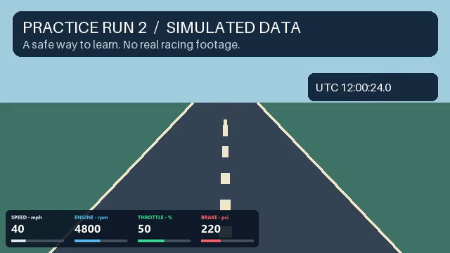

# GoPro VBOX Sync

**Free Windows software for pairing GoPro video with VBOX telemetry.**

[**Download for Windows →**](https://wgm20.github.io/gopro-vbox-sync/)

Use the download page's **Download for Windows** button. No Python installation, payment, activation or GitHub account is needed. A portable ZIP is also available on the [releases page](https://github.com/wgm20/gopro-vbox-sync/releases/tag/v1.4.0b2): extract the entire folder before opening GoProVBOXSync.exe.

> **Beta: Circuit Tools 3 compatibility is unresolved.** Circuit Tools can reject generated VBO files with an authenticity/checksum error and may close. Re-encoding is not a proven fix. A successful export does not guarantee Circuit Tools acceptance. Test a short run first.



## Get started

1. Install and open GoPro VBOX Sync. The app offers a verified download of FFmpeg video tools if needed (110 MB; allow 500 MB free space). Processing works offline after setup.
2. Put the GoPro MP4 files in the folder with your VBOX runs. Choose that folder and click **Scan**. Subfolders are ignored.
3. Tick the videos to **Include**. Click each row to inspect its preview and check rotation.
4. Choose resolution and overlay, then **Preview output** and **Create files**.
5. Read the **Report**. Keep the generated MP4 and VBO files together. The MP4 also plays in ordinary video players.

**Start with Help → Try practice recordings.** Two short synthetic movies and matching data are included. Try unticking one run and exporting the other. The illustrated **Help → Quick-start guide** works offline and covers setup, overlays, troubleshooting and privacy.

## What it does

- Matches by GoPro GPS timestamps, checks concurrent position and speed, and handles partial overlaps, gaps, midnight and consecutive camera chapters.
- Suggests upright rotation from camera metadata and gives you a preview to check.
- Exports only the videos you tick. Keeps the whole video chapter and links only overlapping VBOX samples.
- Adds speed, RPM, throttle and brake with a built-in dashboard or a supported scene.
- Renders a supported full scene, excluding the rear camera, with proportional gauges and an undistorted track map.
- Preserves source recordings. New outputs are published only after validation; changed settings require a fresh output folder.

| Option | Result |
|---|---|
| HD / Compact | Longest edge up to 1920 / 1280 pixels |
| Full resolution | Original image dimensions after rotation |
| Overlay: None | Corrected video without burned-in data |
| Overlay: Driving data | Four channels; leave Scene blank for the built-in dashboard |
| Overlay: Full scene · no rear camera | Supported gauges, artwork, map, G-ball and lap/delta displays from a selected scene |

**All options encode new H.264 video with compression loss.** Full resolution does not mean copying the original compressed stream.

## Requirements and limits

Windows 10/11 on 64-bit Intel/AMD; ARM is not tested. The installer is unsigned, so Windows may display an unknown-publisher warning. Release assets include SHA-256 checksums.

Original GPS-equipped GoPro recordings are required. The parser supports GPS9 and GPS5/GPSU metadata; cameras without GPS, GPS-disabled recordings, edited/retimed movies and 360° footage requiring reprojection cannot be matched automatically. Clock-fit precision is not a guarantee of absolute frame-level alignment; inspect a distinctive event visually.

VBO files must use the supported Video VBOX schema with existing video index/time columns. The built-in dashboard expects speed in km/h, RPM, TPS in percent and Brake in psi; it displays speed in mph. Missing required channels or incompatible units stop overlay export.

Selecting a `.VVHSN` scene requires a separate installation of **VBOX Video Setup**. Its installed library is used locally. Proprietary libraries, scene artwork and real recordings are not included. Scene support covers a tested subset, not every editor feature. Lap/delta timing and G-ball displays are derived from recorded data and may differ from the recorder's values.

## Privacy, licence and support

Processing stays on your computer. There is no activation, account, analytics or automatic update service. Internet access is used only for requested video-tools setup or when you open external links. **Help → Check for updates** opens the releases page; installing updates remains your choice.

Settings, practice copies, error logs and downloaded tools live in `%LOCALAPPDATA%\GoProVBOXSync`. Uninstalling retains them and your exports. Review reports before sharing: they may contain source paths, filenames and GPS data.

The app and synthetic demo are [MIT licensed](LICENSE): use, modify and share them freely with the licence notice. [Third-party notices](THIRD_PARTY_NOTICES.md) apply separately. This project is independent and is not affiliated with or endorsed by GoPro or Racelogic.

[Report a problem](https://github.com/wgm20/gopro-vbox-sync/issues/new/choose) · [Build from source](BUILDING.md) · [Contribute](CONTRIBUTING.md) · [Release notes](CHANGELOG.md)

## Source / command line

For developers with Python 3.11+ and FFmpeg/FFprobe available:

```powershell
python -m pip install -e .
python -m goprovbox "C:\Recordings\Track day" --gui
python -m goprovbox "C:\Recordings\Track day" --scan --report scan.json
python -m goprovbox "C:\Recordings\Track day" --overlay --encoder software
python -m unittest discover -s tests -v
```

The Windows release is built and tested with Python 3.13.15. Explicit `GOPROVBOX_FFMPEG` and `GOPROVBOX_FFPROBE` paths are supported, as are existing tools on PATH or in Circuit Tools 3. See [BUILDING.md](BUILDING.md) for packaging and release verification.

Format references: [GoPro GPMF](https://github.com/gopro/gpmf-parser), [Video VBOX Lite manual](https://www.racelogic.co.uk/_downloads/vbox/Manuals/Data_Loggers/RLVBVDLT_Manual-English.pdf), [Circuit Tools support](https://en.racelogic.support/motorsport/software/ct3/). The parser is independently implemented.
